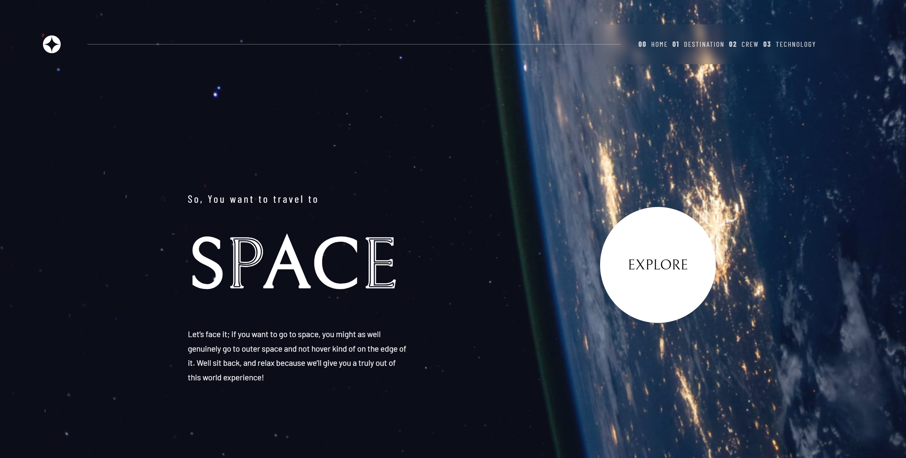
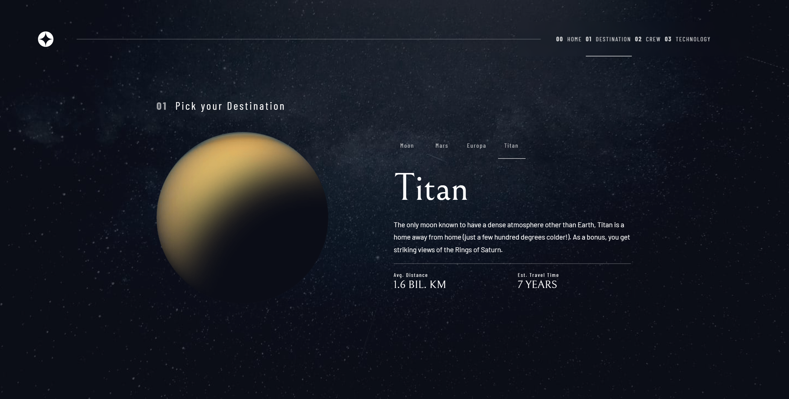
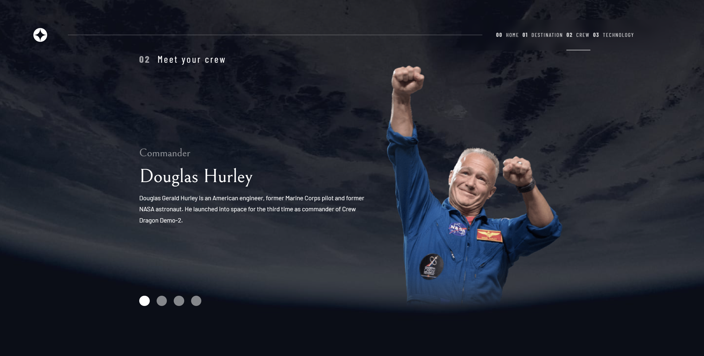
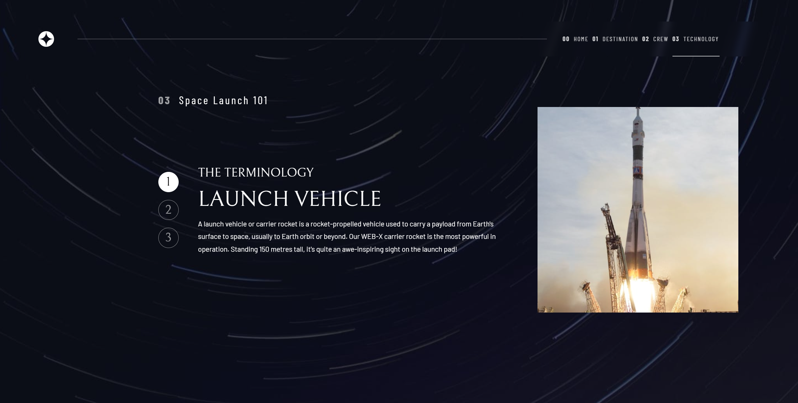

# Frontend Mentor - Space tourism website solution

## Note

**This is a work in progress, See the progres in the [The challenge](#the-challenge) below**

This is a solution to the [Space tourism website challenge on Frontend Mentor](https://www.frontendmentor.io/challenges/space-tourism-multipage-website-gRWj1URZ3). Frontend Mentor challenges help you improve your coding skills by building realistic projects. 

## Table of contents

- [Overview](#overview)
  - [The challenge](#the-challenge)
  - [Screenshot](#screenshot)
  - [Links](#links)
- [My process](#my-process)
  - [Built with](#built-with)
  - [What I learned](#what-i-learned)
- [Author](#author)
- [Acknowledgement](#acknowledgement)

## Overview

### The challenge

Users should be able to:

- [X] View each page and be able to toggle between the tabs to see new information
- [ ] View the optimal layout for each of the website's pages depending on their device's screen size
- [ ] See hover states for all interactive elements on the page

### Screenshot

### Links

- Link to Site (Github Page: Coming Soon)

## My process

### Built with

- [Angular](https://reactjs.org/) - JS library
- [SCSS](https://nextjs.org/) - React framework

### What I learned

I started this project wanted to mainly learn more about Angular and CSS.

I think I learned quite a lot of CSS concepts, but not so much more Angular since this project does not necessarily require much interactivity

## Author

- Frontend Mentor - [@SupakornSJB](https://www.frontendmentor.io/profile/SupakornSJB)
- Github [SupakornSJB](https://github.com/SupakornSJB)
- linkedIn - [Supakorn](https://www.linkedin.com/in/supakorn-senlamai/)

## Acknowledgement

Thank you very much to [Frontend Mentor](https://www.frontendmentor.io) for the beautiful design and the opportunity!

If you are looking for multiple beautiful projects to hone your frontend skills, be sure to check them out!
